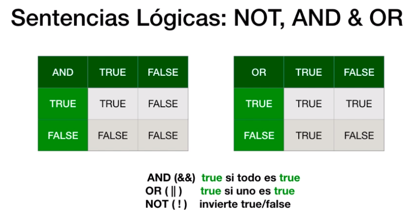

# [JavaScript 2020: Curso desde Principiante hasta Profesional](https://www.udemy.com/course/javascript-moderno-para-principiantes)

# Índice

- **Sección 1: Introducción al curso de JavaScript.**
  - 1. Bienvenida al curso.
  - 2. ¿Cómo hacer preguntas?
  - 3. El editor de código
  - 4. El navegador y Node.js
  - 5. Incorporar código JavaScript
  - 6. Ejecutar JavaScript en la terminal MAC.
  - 7. Ejecutar JavaScript en la terminal Windows.
  - 8. Cómo realizar el curso
- **Sección 2: Fundamentos de Programación en JavaScript**
  - 9. Introducción
  - 10. ¿Qué es Javascript?
  - 11. Notas sobre JavaScript.
  - 12. Variables y tipos de datos.
  - 13. Reglas en el uso de variables.
  - 14. Comentarios en el código.
  - 15. Conversión de variables.
  - 16. Mutación de variables.
  - 17. Operadores matemáticos.
  - 18. Operadores Lógicos.
  - 19. Operador typeof.
  - 20. Operadores de incremento y decremento.
  - 21. Operadores de asignación.
  - 22. Conoce más sobre los Operadores en JavaScript.
  - 23. Ejercicio de codificación 1.
  - 24. Solución al ejercicio de codificación 1.
  - 25. La consola.
  - 26. Recursos.
- **Sección 3: HTML5 y CSS3**
  - 27. Introducción.
  - 28. Estructura de una página HTML5.
  - 29. Etiquetas.
  - 30. CSS.
- **Sección 4: Sentencias y bucles**
  - 31. Introducción.
  - 32. Sentencia if/else.
  - 33. Sentencias lógicas.
  - 34. Operador ternario.
  - 35. Sentencia Switch.
  - 36. Sentencias for.
  - 37. Sentencias while.
  - 38. Sentencias do..while.
  - 39. Valores verdaderos y falsos.
  - 40. Ejercicio de codificación 2.
  - 41. Solución al ejercicio de codificación 2.
  - 42. Código de la sección.
- **Sección 5: Funciones en JavaScript**
  - 43. Introducción.
  - 44. Creando nuestra primera función.
  - 45. Argumentos en las funciones.
  - 46. Ejemplo: función convierte Fahrenheit a Celsius.
  - 47. Ejemplo: función calcular edad.
  - 48. Ejercicio de codificación 3.
  - 49. Solución al ejercicio de codificación 3.
  - 50. Funciones como expresiones.
  - 51. Argumentos no definidos (undefined).
  - 52. Argumentos Nulos (Nulls).
  - 53. Argumentos por defecto.
  - 54. Plantillas de textos (Template strings).
  - 55. Ejercicio de codificación 4.
  - 56. Solución ejercicio codificación 4.
  - 57. Código de la sección.
- **Sección 6: Arreglos y Objetos**
  - 58. Introducción.
  - 59. ¿Qué es un Arreglo?
  - 60. Declaración de arreglos en JavaScript.
  - 61. Operaciones con arreglos.
  - 62. Arreglos con datos de diferentes tipos.
  - 63. Creando objetos de forma literal.
  - 64. Creando objetos con la sintaxis Object.
  - 65. Objetos y métodos.
- **Sección 7: Manipulación del DOM**
  - 66. Introducción.
  - 67. ¿Qué es el DOM?
  - 68. Creando el proyecto.
  - 69. Examinando el DOM.

---

## Sección 1: Introducción al curso de JavaScript.

### 4. El navegador y Node.js
Instalación de NodeJS y NVM en Ubuntu WSL
```bash
sudo apt-get install curl
curl -o- https://raw.githubusercontent.com/nvm-sh/nvm/v0.35.3/install.sh | bash # Instala NVM
nvm --version # Comprobar la versión instalada
nvm install node # Instala Node
```

## Sección 2: Fundamentos de Programación en JavaScript

### 12. Variables y tipos de datos.

```javascript
var primerNombre = 'Jask';
var edad = '20';
var sueldo = 2019.12;
var tieneTrabajo = true;
var indefinida;
tieneTrabajo = null; // Reasignando valor a la variable "tieneTrabajo"
```

### 13. Reglas en el uso de variables.
- **Buena práctica**: siempre empezar con **minúsculas** las variables, y si es un nombre compuesto, la siguiente palabra empieza con mayúsculas. Ejemplo: **primerNombre**.
- Existen **palabras reservadas** del propio lenguaje, como *function*, *if*, *while*, etc.
- No se pueden definir números ni símbolos al comienzo de una variable, a **excepción** con dolar ($) o guión bajo (_).

### 14. Comentarios en el código.
```javascript
// Esto es un comentario de una sola línea
/*
Esto es un 
comentario de
varias líneas
*/
```

 ### 15. Conversión de variables.
 ```javascript
var primerNombre, edad, sexo; // Declaración de 3 variables en una sola línea.
primerNombre = 'Jask';
sexo = 'indefinido';
```

### 18. Operadores Lógicos
```javascript
var edad01 = 20;
var edad02 = 18;
var edad03 = 20;
var mayorQue = edad01 > edad02; // True 
var menorQue = edad01 < edad02; // False
var igualdad = edad01 == edad03; // True
```
### 19. Operador typeof
- Devuelve el tipo de variable que se le está pasando al operador.
- **NO** es una función, por eso no se utilizan paréntesis.
```javascript
typeof edad01; // Number
typeof 'Esto es un texto'; // String
```

### 20. Operadores de incremento y decremento
- Aumenta o disminuye en 1 el valor numérico de una varibale.
  - **Incremento**: ++
  - **Decremento**: --
  
```javascript
var edad01 = 20;
var edad02 = 11;

edad01++; // Equivale a 21
edad02--; // Equivale a 10 
```
## Sección 4: Sentencias y bucles

### 33. Sentencias lógicas


### 34. Operador ternario
```javascript
// Operadores ternario
var nombre = 'Jask';
var edad = 19;

edad >= 18 ? console.log('Es mayor de edad') : console.log('No es mayor de edad');
// Es lo mismo que
if(edad >= 18) {
   console.log('Es mayor de edad'); 
}else{
   console.log('No es mayor de edad');
} 
```

### 35. Sentencia Switch
```javascript
// Sentencia switch
var mes = 3;
switch(mes){
   case 1:
      console.log('Enero');
      break;
   case 2:
      console.log('Febrero');
      break;
   case 3:
      console.log('Marzo');
      break;
   default:
      console.log('El mes no existe');
}
```

### 36. Sentencias For
```javascript
for (var i=0; i<= 10; i++){
   console.log(i);
}
```

### 37. Sentencia while
```javascript
var i = 0;
while (i <= 10){
   console.log(i);
   i++;
}
```

### 38. Sentencia do..while
- Comprueba la condición al **finalizar** el bucle.

```javascript
var i = 12;
do {
   console.log(i);
   i++;

}while(i<= 10)
```

## Sección 5: Funciones en JavaScript

### 44. Creando nuestra primera función
- **Functión**: operación que va a devolver un resultado.
```javascript
function bienvenido(){
   console.log('Bienvenido');
}

bienvenido();

function bienvenido2(){
   return 'Bienvenido de nuevo';
}

var mensaje = bienvenido2();
console.log(mensaje);
```

### 45. Argumentos en las funciones
- Partes de una función
  - Parámetros: entradas
  - Código
  - Salida

```javascript
function cuadradoNumero(num){
   var resultado = num * num;
   return resultado;
}

var numero = 3;
var valor = cuadradoNumero(numero);
console.log(valor);
console.log(cuadradoNumero(5));
```

### 46. Ejemplo: función convierte Fahrenheit a Celsius
```javascript
function convertirFAHaCelcius(gradoFah){
   var celsius = (gradoFah - 32) *  5 / 9;
   return celsius;
}

var temp1 = convertirFAHaCelcius(32); 
console.log(temp1); // 0ºC
var temp2 = convertirFAHaCelcius(68); 
console.log(temp2); // 20ºC
```
### 47. Ejemplo: función calcular edad
```javascript
function calcularEdad(anio){
   return 2020 - anio;
}

var edad = calcularEdad(1990); // 30
```

### 50. Funciones como expresiones
```javascript
var prueba = function(nombre){
   return 'Hola ' + nombre;
}

console.log(prueba('Jask'));
```
### 51. Argumentos no definidos (undefined)
- El compilador separa un espacio en la memoria, tiene un puntero hacia la dirección de memoria pero no tiene ningún valor.
```javascript
var nombre; // = 'Jask';
var prueba = function(n){
   return 'Hola ' + n;
}

console.log(prueba(nombre));
```

### 52. Argumentos Nulos (Nulls)
- La variable apunta a un espacio de memoria pero con un valor **nulo**.
- Puede usarse en un **IF**.
```javascript
var a 
a = null; 
var valorNulo = function(a) {
   return a
}

console.log(valorNulo(a));
```

### 53. Argumentos por defecto
```javascript
var sumar = function(a, b, c = 3){
   return a + b + c;
}

console.log(sumar(10,4)); // 17
```

### 54. Plantillas de textos (Template strings)
- Concatena partes de una cadena con una expresión.
- Utiliza el símbolo del dolar al comienzo de la variable. Esta va entre llaves. 
- Utiliza tildes invertidas al comienzo del string.

```javascript
var nombre = 'Jask';
console.log(`El nombre es ${nombre}`)

var a = 5;
var b = 10;
console.log('La suma es: ' + (a+b));
console.log(`La suma es: ${a + b}`);
```

## Sección 6: Arreglos y Objetos

### 59. ¿Qué es un Arreglo?


### 60. Declaración de arreglos en JavaScript
```javascript
var nombres = ['Jask', 'Menéame', 'Feedly', 'Genbeta'];
var vegetales = new Array('Tomate', 'Canónigos', 'Lechuga', 'Zanahorias');

console.log(nombres[0])
console.log(nombres.length)
console.log(vegetales[2])
```
### 61. Operaciones con arreglos
```javascript
var frutas = ['pera', 'manzana', 'plátano', 'kiwi']
console.log(frutas);

// Recorrer arreglos
for (i=0; i<= frutas.length - 1; i++) {
   console.log(frutas[i]);
}

// La mejor forma de iterar
frutas.forEach(function (elemento, indice, array){
   console.log(elemento, indice);
})

// Añade elemento al final del array
frutas.push('naranja');

// Añade elemento al compienzo del array
frutas.ushift('fresa');

// Elimina elemento del final del array
frutas.pop();

// Elimina elemento del comienzo de larray
frutas.shift();

// Posición del elemento dentro del array
frutas.indexOf('plátano');

// Eliminar elementos del array en cualquier posición
frutas.splice(1,2); // Elimina la posición 1 y la 2
```

### 63. Creando objetos de forma literal
```javascript
var persona  = {
   // Propiedades o Atributos
   nombre: 'Pablo',
   apellido: 'González',
   gustos: ['Fútbol', 'Películas', 'Series', 'Videojuegos'],
   trabajo: 'Programador',
   casado: true
};

console.log(persona)
console.log(persona.apellido)
console.log(persona['trabajo'])

// Mutación
persona.casado = false; // Se recomienda hacer desde el propio método.
console.log(persona.casado);
```

### 64.Creando objetos con la sintaxis Object
```javascript
var persona = new Object();

// Añadiendo Propiedades
persona.nombre = 'Ana';
persona.apellido = 'Ruíz';
persona['trabajo'] = 'Developer';
console.log(persona);
```

### 65. Objetos y métodos
- Los **métodos** son funciones creadas **dentro de un objeto**. Al estar dentro de un objeto, se crean como métodos del objeto.
- Se utiliza el operador **this** para no enviar parámetros por fuera de la función/método.
```javascript
var persona  = {
   // Propiedades o Atributos
    nombre: 'Ramiro',
    apellido: 'González',
    gustos: ['Fútbol', 'Películas', 'Series', 'Videojuegos'],
    trabajo: 'Programador',
    casado: true,
    anioNacimiento: 1954,
    
    // Métodos
    calcularEdad: function(){
       return 2019 - this.anioNacimiento; // Utiliza el año de nacimiento dentro de la propiedad anioNacimiento
    }
};

console.log(persona);
var edad = persona.calcularEdad();
console.log(edad);
```

## Sección 7: Manipulación del DOM

# Bibliografía
- [Instalación de NodeJS y NVM en WSL](https://docs.microsoft.com/es-es/windows/nodejs/setup-on-wsl2)
- [Expresiones y operadores](https://developer.mozilla.org/es/docs/Web/JavaScript/Guide/Expressions_and_Operators)
- [Funciones anónimas](https://riptutorial.com/es/javascript/example/726/funcion-anonima)
- [Funciones como variables](https://riptutorial.com/es/javascript/example/716/funciones-como-variable)