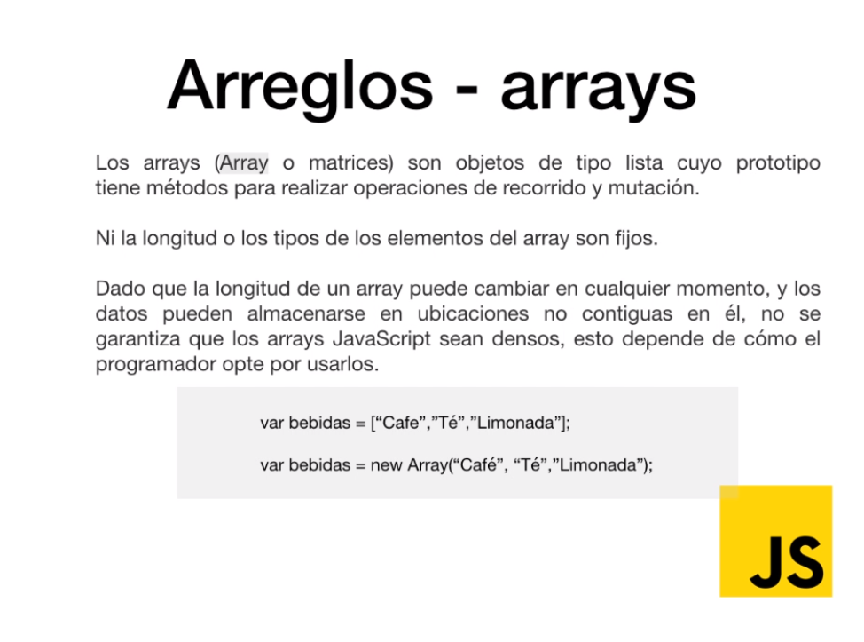

## Sección 6: Arreglos y Objetos
58. Introducción.
59. ¿Qué es un Arreglo?
60. Declaración de arreglos en JavaScript.
61. Operaciones con arreglos.
62. Arreglos con datos de diferentes tipos

### 59. ¿Qué es un Arreglo?


### 60. Declaración de arreglos en JavaScript
```javascript
var nombres = ['Jask', 'Menéame', 'Feedly', 'Genbeta'];
var vegetales = new Array('Tomate', 'Canónigos', 'Lechuga', 'Zanahorias');

console.log(nombres[0])
console.log(nombres.length)
console.log(vegetales[2])
```
### 61. Operaciones con arreglos
```javascript
var frutas = ['pera', 'manzana', 'plátano', 'kiwi']
console.log(frutas);

// Recorrer arreglos
for (i=0; i<= frutas.length - 1; i++) {
   console.log(frutas[i]);
}

// La mejor forma de iterar
frutas.forEach(function (elemento, indice, array){
   console.log(elemento, indice);
})

// Añade elemento al final del array
frutas.push('naranja');

// Añade elemento al compienzo del array
frutas.ushift('fresa');

// Elimina elemento del final del array
frutas.pop();

// Elimina elemento del comienzo de larray
frutas.shift();

// Posición del elemento dentro del array
frutas.indexOf('plátano');

// Eliminar elementos del array en cualquier posición
frutas.splice(1,2); // Elimina la posición 1 y 2
```